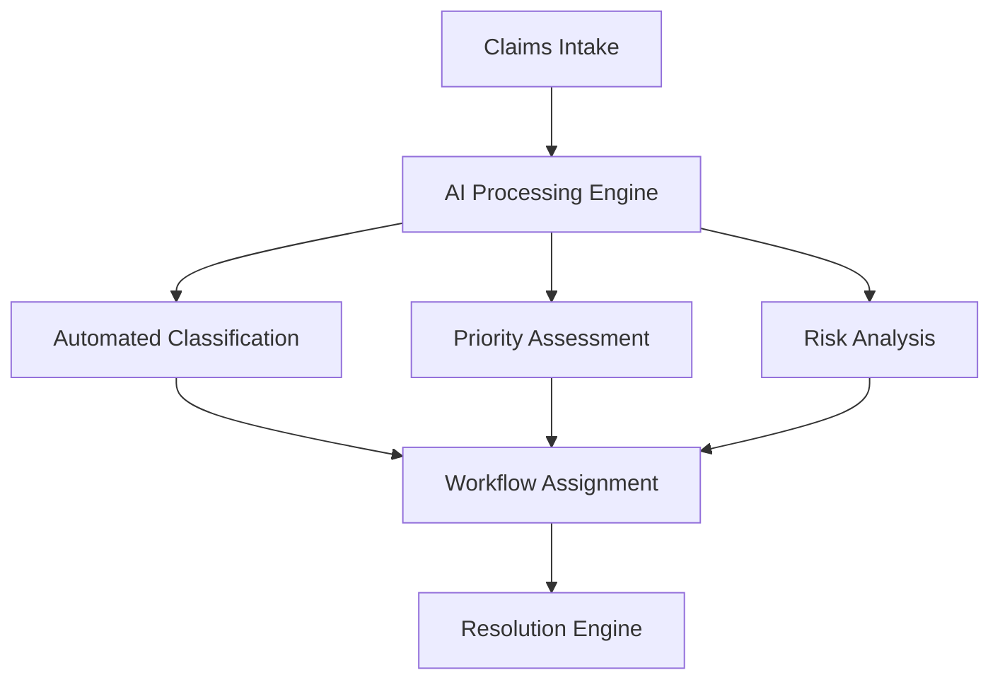
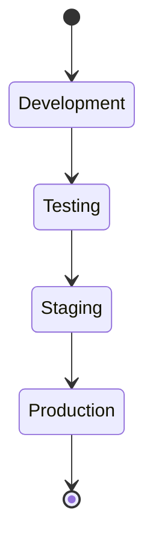

# GONNA.AI

<div align="center">

<h3>
    
</h3>

[](https://opensource.org/licenses/MIT)
[](https://www.python.org/)
[](https://flask.palletsprojects.com/)
[](https://www.mysql.com/)
[](https://github.com/features/security)
[](https://github.com/yourusername/gonna.ai)

<hr>

[Documentation](https://docs.gonna.ai) | [API Reference](https://api.gonna.ai) | [Enterprise Support](https://gonna.ai/enterprise)

<br>

<div align="center">
    
</div>

</div>

<hr>

## Overview

GONNA.AI is an enterprise-grade claims processing solution that leverages artificial intelligence to streamline BPO operations. Our platform integrates advanced machine learning algorithms with robust workflow automation to deliver unprecedented efficiency in claims management.

<details>
<summary><b>Platform Capabilities</b></summary>



</details>

## Technical Architecture

<table>
<tr>
<td>

### Core Components
- Advanced AI Processing Engine
- Real-time Analytics System
- Enterprise Security Framework
- Scalable Database Architecture
- Load-balanced API Infrastructure

</td>
<td>

### Integration Layer
- RESTful API Gateway
- GraphQL Interface
- Event-driven Architecture
- Message Queue System
- WebSocket Support

</td>
</tr>
</table>

## System Requirements

```typescript
interface SystemRequirements {
    compute: {
        cpu: "4+ cores",
        ram: "16GB minimum",
        storage: "SSD required"
    },
    software: {
        os: ["Linux", "Docker"],
        database: "MySQL 8.0+",
        runtime: "Python 3.8+"
    },
    network: {
        bandwidth: "100Mbps+",
        latency: "<50ms"
    }
}
```

## Installation

<details>
<summary><b>Standard Deployment</b></summary>

```bash
# Clone repository
git clone https://github.com/yourusername/gonna.ai.git
cd gonna.ai

# Create virtual environment
python -m venv venv
source venv/bin/activate

# Install dependencies
pip install -r requirements.txt

# Configure environment
cp .env.example .env
# Edit .env with your configurations

# Initialize database
mysql -u root -p < schema.sql
python manage.py db upgrade

# Start application
python main.py
```

</details>

<details>
<summary><b>Docker Deployment</b></summary>

```bash
# Build container
docker build -t gonna.ai .

# Run container
docker run -d \
    -p 8080:8080 \
    -v /path/to/config:/app/config \
    --name gonna.ai \
    gonna.ai:latest
```

</details>

## API Reference

### Authentication
```http
POST /api/v1/auth/token
Content-Type: application/json
{
    "client_id": "your_client_id",
    "client_secret": "your_client_secret"
}
```

### Claims Processing
```http
POST /api/v1/claims/process
Authorization: Bearer {token}
Content-Type: application/json
{
    "claim_id": "CLM-123",
    "priority": "HIGH",
    "documents": ["doc1", "doc2"]
}
```

## Performance Metrics

<div align="center">

```ascii
Performance Graph
┌────────────────────────────────────────────────────────┐
│                                                  ****  │
│                                          ********      │
│                                  ********              │
│                          ********                      │
│                  ********                              │
│          ********                                      │
│  ********                                              │
└──────────────────────────────────────────────────────-→
   Jan  Feb  Mar  Apr  May  Jun  Jul  Aug  Sep  Oct  Nov
```

</div>

## Security Framework

```python
SECURITY_CONFIG = {
    'encryption': {
        'data_at_rest': 'AES-256-GCM',
        'data_in_transit': 'TLS 1.3'
    },
    'authentication': {
        'methods': ['OAuth2', 'JWT', 'SAML'],
        'mfa': True
    },
    'compliance': {
        'SOC2': True,
        'HIPAA': True,
        'GDPR': True
    }
}
```

## Development Pipeline



## Testing Framework

### Unit Tests
```python
def test_claim_processing():
    claim = ClaimProcessor(claim_id="TEST-001")
    result = claim.process()
    assert result.status == "SUCCESS"
    assert result.processing_time < 5.0
```

### Integration Tests
```python
def test_end_to_end_flow():
    client = TestClient()
    response = client.post("/api/v1/claims", 
                         json={"claim_data": "test"})
    assert response.status_code == 200
```

## Monitoring & Analytics

<details>
<summary><b>System Metrics</b></summary>

```graphql
query SystemMetrics {
    performance {
        cpu_usage
        memory_consumption
        api_latency
        database_connections
    }
    security {
        active_sessions
        failed_attempts
        security_incidents
    }
}
```

</details>

## Code Quality

[](https://frontend.code-inspector.com/public/project/your-project/dashboard)

```python
QUALITY_STANDARDS = {
    'code_coverage': '95%+',
    'lint_compliance': 'strict',
    'documentation': 'comprehensive',
    'type_hints': 'required'
}
```

## Contributing

We follow a strict development protocol to maintain code quality and security. Please review our [Contributing Guidelines](CONTRIBUTING.md) before submitting changes.

```graphql
type ContributionWorkflow {
    fork: Repository!
    branch: String!
    commit: [Commit!]!
    test: TestSuite!
    pullRequest: PR!
}
```

## Enterprise Support

For enterprise support and custom deployments, contact our solutions team:

```javascript
const support = {
    email: "enterprise@gonna.ai",
    phone: "+1 (555) 123-4567",
    hours: "24/7",
    sla: "99.99% uptime"
};
```

## License

Copyright (c) 2024 GONNA.AI. All rights reserved.

Licensed under the [MIT License](LICENSE).

<div align="center">

<sub>Built with precision by the GONNA.AI Team</sub>

</div>

<style>
.enterprise-badge {
    background: linear-gradient(45deg, #1e3c72, #2a5298);
    padding: 5px 10px;
    border-radius: 3px;
    color: white;
    font-weight: bold;
}
</style>
