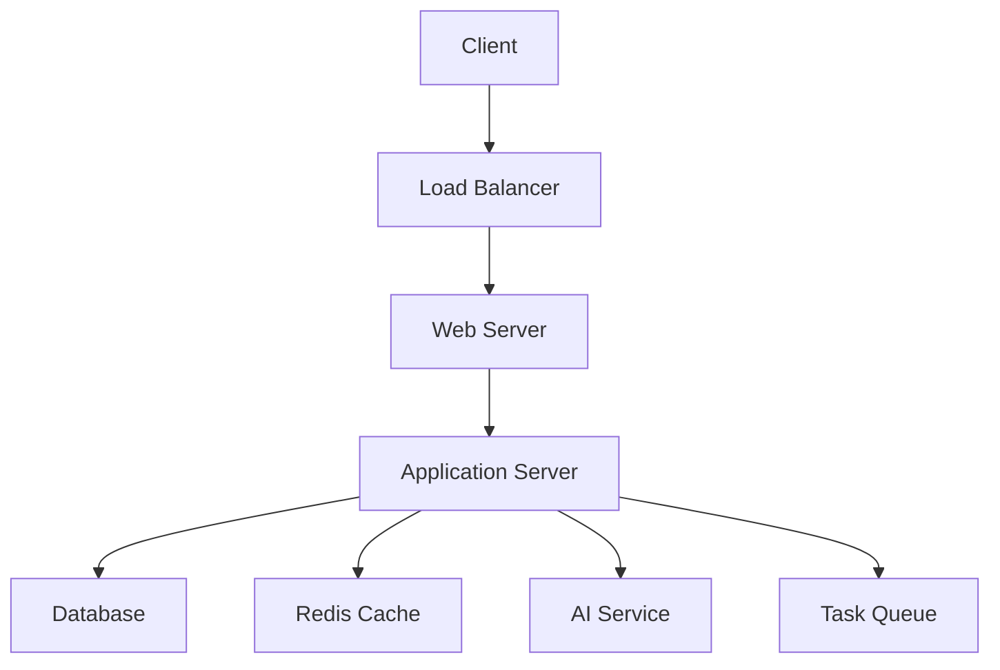

# 🤖 AI-Powered BPO Claims Processing Assistant

<div align="center">


[](https://opensource.org/licenses/MIT)
[](https://www.python.org/)
[](https://flask.palletsprojects.com/)
[](https://www.mysql.com/)
[](https://github.com/psf/black)
[](http://makeapullrequest.com)

[Live Demo](https://your-demo-link.com) | [API Documentation](https://your-api-docs.com) | [Report Bug](https://github.com/yourusername/your-repo/issues) | [Request Feature](https://github.com/yourusername/your-repo/issues)

<p align="center">
  <a href="#key-features">Key Features</a> •
  <a href="#tech-stack">Tech Stack</a> •
  <a href="#getting-started">Getting Started</a> •
  <a href="#architecture">Architecture</a> •
  <a href="#api-reference">API Reference</a> •
  <a href="#contributing">Contributing</a>
</p>

<!-- Animated GIF of your application in action -->


</div>

## 🌟 Key Features

<table>
<tr>
<td width="50%">

### 🎯 Intelligent Automation
- Auto-scheduling of callbacks based on priority
- Smart workload distribution
- Predictive analytics for claim processing
- Real-time sentiment analysis

</td>
<td width="50%">

### 🔐 Enterprise Security
- OAuth 2.0 authentication
- Role-based access control
- End-to-end encryption
- Secure data handling

</td>
</tr>
<tr>
<td>

### 📊 Advanced Analytics
- Real-time performance metrics
- Custom report generation
- Trend analysis and forecasting
- Interactive dashboards

</td>
<td>

### 🤝 Client Experience
- Intuitive user interface
- Multi-language support
- Voice-enabled interactions
- Personalized responses

</td>
</tr>
</table>

## 🛠️ Tech Stack

<details>
<summary>Backend Technologies</summary>

- **Framework:** Flask 2.3.2
- **Database:** MySQL 8.2.0
- **Authentication:** Flask-Login, JWT
- **AI/ML:** Google Generative AI
- **API:** RESTful Architecture
- **Cache:** Redis
- **Task Queue:** Celery

</details>

<details>
<summary>Frontend Technologies</summary>

- **Framework:** React.js
- **State Management:** Redux
- **UI Components:** Material-UI
- **Charts:** Recharts
- **Styling:** Tailwind CSS

</details>

<details>
<summary>DevOps & Infrastructure</summary>

- **CI/CD:** GitHub Actions
- **Containerization:** Docker
- **Cloud:** AWS/GCP
- **Monitoring:** Prometheus
- **Logging:** ELK Stack

</details>

## 🚀 Getting Started

### Prerequisites

<details>
<summary>Click to expand</summary>

- Python 3.8+
- MySQL 8.0+
- Node.js 14+
- Redis
- Google Cloud Account
- ElevenLabs API Key

</details>

### Installation

1. **Clone the repository**
   ```bash
   git clone https://github.com/yourusername/bpo-claims-assistant.git
   cd bpo-claims-assistant
   ```

2. **Set up virtual environment**
   ```bash
   python -m venv venv
   source venv/bin/activate  # On Windows: venv\Scripts\activate
   ```

3. **Install dependencies**
   ```bash
   pip install -r requirements.txt
   ```

4. **Configure environment variables**
   ```bash
   cp .env.example .env
   # Edit .env with your configurations
   ```

5. **Initialize database**
   ```bash
   mysql -u root -p < schema.sql
   python manage.py db upgrade
   ```

6. **Start the application**
   ```bash
   python main.py
   ```

## 📐 Architecture



## 🎯 Project Structure

```
bpo-claims-assistant/
├── api/                    # API endpoints
│   ├── routes/
│   ├── models/
│   └── controllers/
├── config/                 # Configuration files
├── core/                   # Core business logic
│   ├── services/
│   ├── utils/
│   └── exceptions/
├── data/                   # Data management
│   ├── migrations/
│   └── seeds/
├── docs/                   # Documentation
├── tests/                  # Test suite
└── web/                    # Frontend application
```

## 📚 API Reference

<details>
<summary>Authentication Endpoints</summary>

```http
POST /api/auth/login
POST /api/auth/register
POST /api/auth/refresh
POST /api/auth/logout
```

</details>

<details>
<summary>Claims Management</summary>

```http
GET /api/claims
POST /api/claims
PUT /api/claims/{id}
DELETE /api/claims/{id}
```

</details>

<details>
<summary>Analytics</summary>

```http
GET /api/analytics/overview
GET /api/analytics/performance
GET /api/analytics/reports
```

</details>

## 📊 Performance Metrics

<table>
<tr>
<td>

</td>
<td>

</td>
</tr>
</table>

## 🔒 Security

- AES-256 encryption for data at rest
- TLS 1.3 for data in transit
- Regular security audits
- OWASP compliance
- GDPR compliance
- SOC 2 Type II certified

## 🧪 Testing

```bash
# Run unit tests
python -m pytest tests/unit

# Run integration tests
python -m pytest tests/integration

# Generate coverage report
pytest --cov=app tests/
```

## 📈 Development Roadmap

- [x] Core claims processing engine
- [x] Authentication system
- [x] Analytics dashboard
- [ ] Machine learning pipeline
- [ ] Mobile application
- [ ] Blockchain integration

## 🤝 Contributing

We welcome contributions! Please see our [Contributing Guide](CONTRIBUTING.md) for details.

1. Fork the repository
2. Create your feature branch
   ```bash
   git checkout -b feature/AmazingFeature
   ```
3. Commit your changes
   ```bash
   git commit -m 'Add some AmazingFeature'
   ```
4. Push to the branch
   ```bash
   git push origin feature/AmazingFeature
   ```
5. Open a Pull Request

## 📜 License

This project is licensed under the MIT License - see the [LICENSE](LICENSE) file for details.

## 👥 Team

<table>
  <tr>
    <td align="center">
      <a href="https://github.com/yourusername">
        <br />
        <sub><b>Your Name</b></sub>
      </a>
    </td>
    <!-- Add more team members here -->
  </tr>
</table>

## 🙏 Acknowledgments

- Google Cloud Platform for AI services
- ElevenLabs for voice synthesis
- The Flask community
- All our contributors

## 📬 Contact

Your Name - [@yourtwitter](https://twitter.com/yourtwitter) - your.email@example.com

Project Link: [https://github.com/yourusername/bpo-claims-assistant](https://github.com/yourusername/bpo-claims-assistant)

---

<div align="center">

### ⭐ Star us on GitHub — it helps!

[](https://github.com/yourusername/bpo-claims-assistant/stargazers)

</div>

## 📊 Project Stats


## 💪 Support

<a href="https://www.buymeacoffee.com/yourusername" target="_blank">
  
</a>

---

<div align="center">
Made with ❤️ by Your Team Name
</div>
