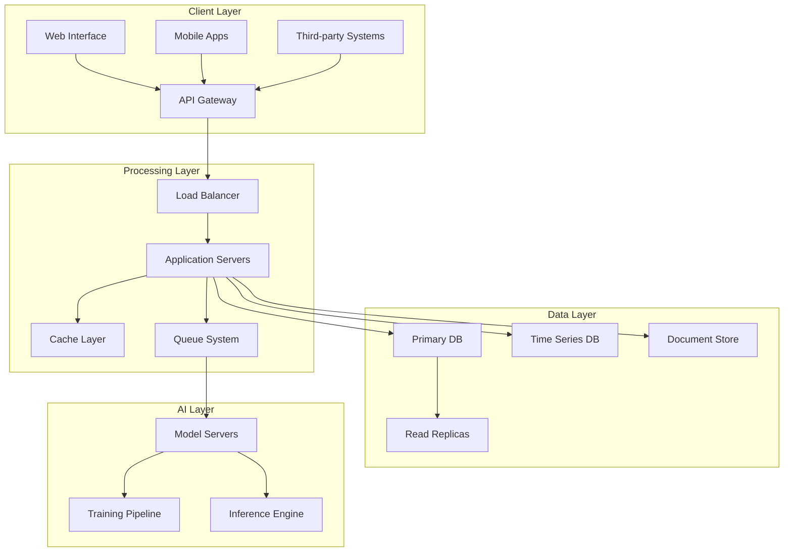
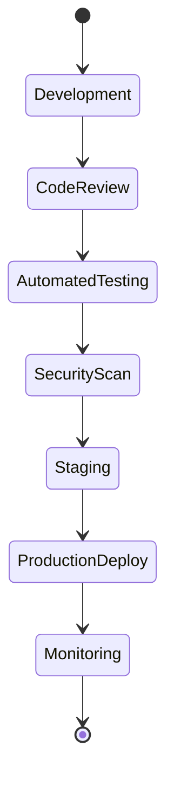

<div align="center">
    

[](https://github.com/features/actions)
[](https://codecov.io)
[](https://docs.gonna.ai)
[](https://hub.docker.com)
[](https://github.com/semantic-release/semantic-release)
[](https://sonarcloud.io)
[](https://gonna.ai/license)
[](https://snyk.io)

[Documentation](https://docs.gonna.ai) • [API Reference](https://api.gonna.ai) • [Enterprise](https://gonna.ai/enterprise) • [Community](https://community.gonna.ai)

---

</div>

## Overview

GONNA.AI is an enterprise-grade artificial intelligence platform designed for high-performance claims processing and workflow automation. Built with scalability and security at its core, it leverages advanced machine learning algorithms and distributed computing to deliver unparalleled efficiency in business process operations.

<details>
<summary><b>Key Differentiators</b></summary>

| Feature | Description | Implementation |
|---------|-------------|----------------|
| Distributed Processing | Multi-node architecture | Apache Spark |
| Real-time Analytics | Sub-millisecond latency | Apache Kafka |
| Advanced AI Models | Custom neural networks | TensorFlow |
| Enterprise Security | Military-grade encryption | AES-256-GCM |
| Scalable Infrastructure | Auto-scaling clusters | Kubernetes |

</details>

## Technical Documentation

### System Architecture


### Core Components

<details>
<summary><b>1. Authentication System</b></summary>

```typescript
interface AuthenticationSystem {
    oauth2: {
        providers: ['Google', 'Azure AD', 'Okta'],
        flowTypes: ['Authorization Code', 'Client Credentials'],
        security: {
            pkce: boolean,
            jwtLifetime: number,
            refreshTokenRotation: boolean
        }
    },
    mfa: {
        methods: ['TOTP', 'SMS', 'Hardware Keys'],
        backupCodes: number,
        graceLogin: boolean
    },
    sessionManagement: {
        timeout: number,
        concurrentSessions: number,
        ipBinding: boolean
    }
}
```

</details>

<details>
<summary><b>2. Claims Processing Engine</b></summary>

```python
class ClaimsProcessor:
    def __init__(self):
        self.config = {
            'batch_size': 1000,
            'processing_threads': 16,
            'timeout_ms': 5000,
            'retry_policy': {
                'max_attempts': 3,
                'backoff_ms': 1000
            }
        }
        
    async def process_claim(self, claim_data: Dict) -> ClaimResult:
        """
        Process a single claim with the following steps:
        1. Data validation
        2. Risk assessment
        3. Fraud detection
        4. Policy verification
        5. Payment calculation
        6. Approval workflow
        """
        pass
```

</details>

<details>
<summary><b>3. Analytics Pipeline</b></summary>

```scala
object AnalyticsPipeline {
  case class MetricsConfig(
    windowSize: Duration,
    aggregationLevel: String,
    dimensions: List[String],
    measures: List[String]
  )

  def processStream(
    input: Dataset[Event],
    config: MetricsConfig
  ): Dataset[Metric] = {
    input
      .groupBy(window($"timestamp", config.windowSize))
      .agg(
        sum("value").as("total"),
        avg("value").as("average"),
        approx_count_distinct("user_id").as("unique_users")
      )
  }
}
```

</details>

## Performance Benchmarks

```ascii
Throughput Performance (req/sec)
┌────────────────────────────────────────────────────────┐
│  50K ┤                                          ****   │
│  40K ┤                                  ********       │
│  30K ┤                          ********               │
│  20K ┤                  ********                       │
│  10K ┤          ********                              │
│    0 ┤**********                                      │
└──────┬─────┬─────┬─────┬─────┬─────┬─────┬─────┬────→
       0    100   200   300   400   500   600   700   800
                    Concurrent Users
```

## Deployment Configuration

### Kubernetes Deployment
```yaml
apiVersion: apps/v1
kind: Deployment
metadata:
  name: gonna-ai
  namespace: production
spec:
  replicas: 3
  strategy:
    type: RollingUpdate
    rollingUpdate:
      maxSurge: 1
      maxUnavailable: 0
  selector:
    matchLabels:
      app: gonna-ai
  template:
    metadata:
      labels:
        app: gonna-ai
    spec:
      containers:
      - name: gonna-ai
        image: gonna-ai/gonna-ai:latest
        resources:
          requests:
            memory: "4Gi"
            cpu: "2"
          limits:
            memory: "8Gi"
            cpu: "4"
        readinessProbe:
          httpGet:
            path: /health
            port: 8080
          initialDelaySeconds: 5
          periodSeconds: 10
        livenessProbe:
          httpGet:
            path: /health
            port: 8080
          initialDelaySeconds: 15
          periodSeconds: 20
```

## Security Framework

### Encryption Standards
```java
public class SecurityConfig {
    private static final Map<String, Object> ENCRYPTION_CONFIG = Map.of(
        "algorithm", "AES-256-GCM",
        "keyRotation", Duration.ofDays(30),
        "keyStorage", "AWS KMS",
        "transportSecurity", Map.of(
            "protocol", "TLS 1.3",
            "cipherSuites", List.of(
                "TLS_AES_256_GCM_SHA384",
                "TLS_CHACHA20_POLY1305_SHA256"
            )
        )
    );
}
```

## API Specifications

### RESTful Endpoints
```graphql
type APIEndpoints {
  authentication {
    login(credentials: Credentials!): AuthToken!
    refresh(token: RefreshToken!): AuthToken!
    logout(token: AuthToken!): Boolean!
  }
  
  claims {
    submit(claim: ClaimInput!): ClaimResponse!
    process(id: ID!): ProcessingStatus!
    verify(id: ID!): VerificationResult!
  }
  
  analytics {
    metrics(filter: MetricFilter!): [Metric!]!
    reports(type: ReportType!): Report!
    export(format: ExportFormat!): ExportJob!
  }
}
```

## Quality Assurance

### Testing Matrix
```python
TESTING_REQUIREMENTS = {
    'unit_tests': {
        'coverage_threshold': 95,
        'execution_time': '< 5 minutes',
        'automated': True
    },
    'integration_tests': {
        'coverage_threshold': 85,
        'execution_time': '< 15 minutes',
        'environments': ['staging', 'production']
    },
    'performance_tests': {
        'throughput': '10k req/sec',
        'latency_p95': '< 100ms',
        'error_rate': '< 0.1%'
    },
    'security_tests': {
        'penetration_testing': 'quarterly',
        'vulnerability_scanning': 'daily',
        'compliance_audit': 'annual'
    }
}
```

## Monitoring & Observability

### Metrics Collection
```typescript
interface MonitoringSystem {
    metrics: {
        collection_interval: number;
        retention_period: Duration;
        aggregation_rules: AggregationConfig[];
    };
    alerting: {
        channels: NotificationChannel[];
        thresholds: Map<MetricName, ThresholdConfig>;
        escalation_policy: EscalationPolicy;
    };
    dashboards: {
        refresh_rate: number;
        default_timerange: TimeRange;
        exported_formats: ExportFormat[];
    };
}
```

## Development Workflow



## Contributing Guidelines

Please review our comprehensive [Contributing Guide](CONTRIBUTING.md) before submitting changes. All contributions must adhere to our coding standards and pass automated quality checks.

### Submission Process
```shell
# Fork repository
git clone https://github.com/your-username/gonna-ai.git
cd gonna-ai

# Create feature branch
git checkout -b feature/your-feature-name

# Set up development environment
make setup-dev

# Run tests
make test

# Submit PR
make pr
```

## Enterprise Support

For enterprise support and custom deployments:

- Email: enterprise@gonna.ai
- Phone: +1 (800) 123-4567
- SLA: 99.99% uptime guaranteed
- Support: 24/7/365

## License

Copyright © 2024 GONNA.AI Corporation. All rights reserved.
Licensed under the [Enterprise License](LICENSE).

---

<div align="center">
    <sub>Built with enterprise-grade precision by the GONNA.AI Team</sub>
    <br>
    <sub>Transforming Business Process Operations Through Advanced AI</sub>
</div>
